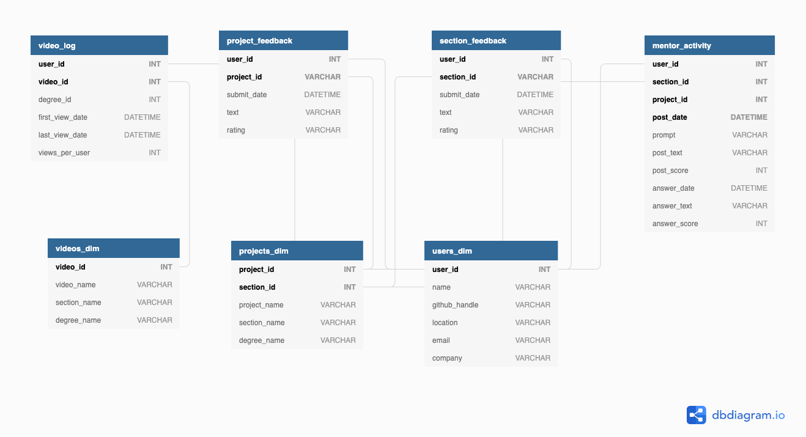
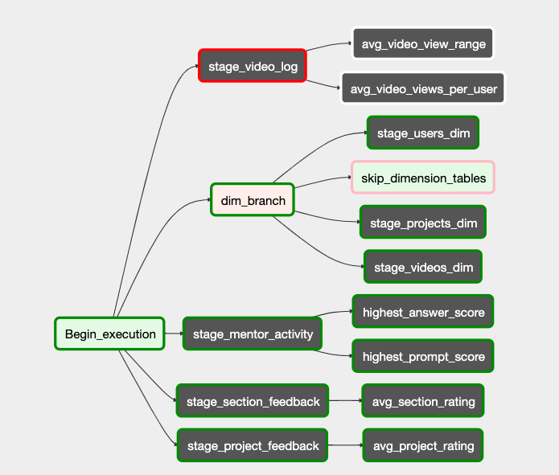

# Data Engineering Capstone Project

Automated Airflow data pipeline that loads data from AWS S3 to AWS Redshift for user activity analytics.

## Repo Directories and Files Dictionary

`airflow/dag/main_dag.py`: Main dag file that glues together the data pipeline

`airflow/plugins/operators/`: Custom built operators and operator queries used for ETL pipeline

`airflow/config/udacity_dwh.cfg` : Redshift cluster configuration file

`airflow/config/airflow.cfg` : Airflow configuration file

`airflow/scripts/connections.py`: Creates AWS redshift and s3 connections within airflow. Uses configuration values from udacity_dwh.cfg. 

`airflow/scripts/entrypoint.sh`: Initializes Airflow connections, webserver, and scheduler.

`airflow/docker-compose.yml`: Creates Docker container for Postgres and Airflow webserver

`airflow/Dockerfile`: Builds Docker image with needed python packages and configuration files

`iac_notebook.ipynb`: IaC (infrastructure as code) notebook for Redshift cluster management

`data_generator.ipynb`: Functions used to create synthetic numerical data 

## Project Scope
Being enrolled in an online education program inspired me to revolve this project around online learning user data. I was hoping to access Udacity's user data for this project. Although after asking Udacity's support team, they politely declined my request. Given that this project is focused on the data pipeline process, data integrity isn't as important. As for plan b, I decided to create numerical user data and use publicly accessible text data.  

## Datasets

Student Userbase Count: 50,000

All data used for the data pipeline is stored within the `sample_data/` directory

Data used for fact tables were partitioned by degree name, year, and month. 

Example S3 path:

s3://udacity-de-capstone/data_science/2019/1/project_feedback.csv

Data used for dimensional tables were stored in one directory. 

Example S3 path:

s3://udacity-de-capstone/dimensional_tables/users_dim.csv

### Data Dictionary

#### Fact Files

##### `project_feedback.csv`

    - user_id: Student's user id
    - project_id: Program's project id
    - submit_date: Date user submitted the feedback
    - text: Student's feedback on project
    - rating: Student's section rating on a scale from one (bad) to three (good)

##### `section_feedback.csv` :

    - user_id: Student's user id
    - section_id: Program's project id
    - submit_date: Date user submitted the feedback
    - text: Student's feedback on section
    - rating: Student's section rating on a scale from one (bad) to three (good)

##### `mentor_activity.csv` : 
    - user_id: Student's user id
    - section_id: Program's section id 
    - project_id: Program's project id
    - post_date: Question's post date
    - prompt: Question's prompt/title
    - post_text: Question's explaination
    - post_score: Question's upvote count from other users
    - answer_date: Answer's date
    - answer_text: Answer
    - answer_score: Answer's upvote count from other users

##### `video_log.csv` : 
    - user_id: Student's user id
    - video_id: Program's video id
    - degree_id: Nanodegree id
    - first_view_date: Date user first viewed the video
    - last_view_date: Date user last viewed the video
    - views_per_user: Amount of time the user viewed the video

#### Dimension Files

`users_dim.csv` : 
    - user_id: Student's user id
    - name: Student's name
    - github_handle: Student's GitHub handle 
    - location: Student's given location
    - email: Student's email
    - company: Company student is currently working at

`projects_dim.csv`: 

    - project_id: Program's project id
    - section_id: Program's section id
    - project_name: Project name
    - section_name: Section name
    - degree_name: Nano degree name

`videos_dim.csv`:

    - video_id: Program's video id
    - video_name: Video name
    - section_name: Section name
    - degree_name: Nano degree name

## Data Model

As you can see in the diagram above, the user_id is the primary key for the majority of the staging tables. Using the user_id column as the primary key combined with the other id column(s) as the clustering columns uniquely identifies each row. Using the ID columns (e.g. section_id, project_id, and video_id) as the clustering columns will organize the tables' order by the ID column. The ordering of the tables will likely reflect the queries partitioning and optimize query runtime. 

## Airflow DAG Architecture 

### Staging Subdags
All S3 data is processed either in the staging fact or staging dimension subdag. The fact subdag processes fact table related data while the dimensional subdag processes dimension table related data. The subdag uses AWS and Redshift connection hooks to execute three major tasks.

Graph view of the main dag:

### Staging Subdag Tasks

- Create a Redshift target table

- Load S3 data to the target table

- Perform data quality check on the target table

- Move rows that cause STL errors to error tables to prevent the staging task from breaking and eliminate the need to re-stage the table

Graph view of the data science staging subdag:

### Dynamic Subdag Parameterization

Both the staging and fact subdags can easily scale up the number of degrees or courses added to the data pipeline with a minimal amount of extra code. Additional degrees can be incorporated into the data pipeline by importing the necessary data to the S3 bucket and adding the degree name to the degree_list within the main dag file. The degree list is looped through the main DAG while the subdag formats the task and table names with the data source and degree name. Having dynamic subdags decreases the amount of hardcoded tasks and increases task parallelization. In addition, it allows efficient distributed bug fixes and clear high-level visibility within the Airflow UI DAG graph view.

### STLCheckOperator

The STLCheckOperator is used within each staging subdag associated with fact table creation downstream. STLCheckOperator loads STL error rows into separate Redshift error tables. The downstream stl_check operator fails to prevent fact tables downstream to be created with data integrity issues. The user can then make changes to the rows within the error table and insert the fixed rows back into the staging table. After the error table is dropped, the user can re-run the stl_check operator to allows downstream fact tables to be created. The STLCheckOperator allows the user to fix the errors in one centralized table without having to search through files in S3. It also eliminates the need to re-run the entire staging task once the errors are fixed since the fixed rows can be inserted into the staging table. 

Example of stl_check operator failing failing to prevent downstream turmoil:

# Project Application

## Data Science Use Cases
- Build binary classification models to predict student churn rate given users activity in the course(s).

- Develop behavioral segmentation sample groups used for email marketing A/B testing. The sample groups can be based upon user activity results within the fact tables and user demographics within the user dimension tables.

- Discover insights on which videos have the most views per user. Use other sources within the data warehouse such as mentor activity, user's section or project feedback to investigate possible reasons why those videos have a high retention rate.

## Why technologies:

### Airflow:
Airflow's dynamic subdag and task parameterization are what make Airflow the best workflow management tool for this data pipeline. As mentioned in the "Dynamic Subdag Parameterization" section, Airflow's dynamic capabilities minimized the amount of hard-coded tasks. 

In addition, Airflow's amazing graph and tree view UI gives a great birds-eye view of the data pipeline design. Both views came in handy for debugging and optimizing task dependencies. 

### AWS S3:

S3 was used as the only data storage service given my previous experiences using it in this program and other projects. Since Airflow allows other cloud storage platforms, it would be seamless to use another service like Google Cloud. 

### AWS Redshift:

Redshift was used to take advantage of Redshift's MPP (massive parallel processing), columnar storage, and relational database storage system. Also, the Redshift cluster pause ability was a huge time saver that allowed me to resume the cluster without having to configure it all over again!

## Scenarios

### Data Pipeline Scheduling:
The data pipeline was scheduled to run on a monthly basis. Although in a production environment it depends on the application of the data pipeline and preference of the client. In my opinion, this data pipeline would probably be used for analytics rather than day-to-day operational reports. A longer interval of bi-weekly or monthly basis seems appropriate. 

### Data Scalibility:

In a given situation where the data were increased by 100x, I would advise increasing the amount of DC2 compute nodes within the cluster to meet the demand. Although if the amount of DC2.xlarge nodes is greater than or equal to eight or any DS2.8xlarge nodes are used, it is recommended to switch over to RA3 according to [AWS.]('https://aws.amazon.com/redshift/pricing/')

### Data Accesibility:
If the data produced by the data pipeline was used on a daily operational level then the DAG scheduled interval parameter can be easily changed to execute a daily basis at an optimal time. In this case, it may be helpful to define SLA (service level agreement) for the DAG given the tighter time constraints.

In a scenario where the database was needed to be accessed by hundreds of people, the database privileges and CPU resources would need to change. On the scale of a hundred users, I would advise partitioning each user into specified groups with different privileges. Each user will be given appropriate access to the Airflow data pipeline, AWS S3 bucket, and AWS Redshift cluster. For example, data engineers would likely have admin privileges and data scientists/analysts would have S3 read access and Redshift read/write access. 

In regards to AWS resources, CPU would need to be scaled up or upgraded to higher processing power. In addition, table partitions within the Redshift distributed database could be optimized to decrease query runtime. 

# Run the Code

Steps:

- If homebrew and git is not installed (macOS/Linux), paste commands separately within your terminal:

    - `/usr/bin/ruby -e "$(curl -fsSL https://raw.githubusercontent.com/Homebrew/install/master/install)"`

    - `brew install git`

- Clone this repo: `git clone https://github.com/marshall7m/data_engineering_capstone.git`

- Fill in the AWS info within `aws.cfg` and postgres database info within `docker-compose.yml`

- Run cells within `iac_notebook.ipynb` to launch a Redshift cluster and create a S3 bucket

- Optional: Configure Airflow DAG scheduling within `main_dag.py` (default is set to monthly with start_date = 1/1/2019 and end_date = 2/1/2019)

- Download Docker Desktop using this link: https://docs.docker.com/get-docker/

- To launch Airflow UI and run DAG:
    - Launch Docker
    - Change to airflow directory from within repo: `cd airflow`
    - Build Docker images: `docker build -t my-airflow .`
    - Compose Docker Container: `docker-compose up`
    - Go to http://localhost:8080/ on your web browser
    - Toggle DAG to ON
    - Refill coffee and wait for DAG to complete

    
